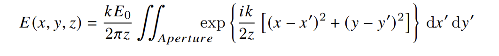
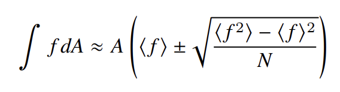
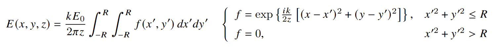
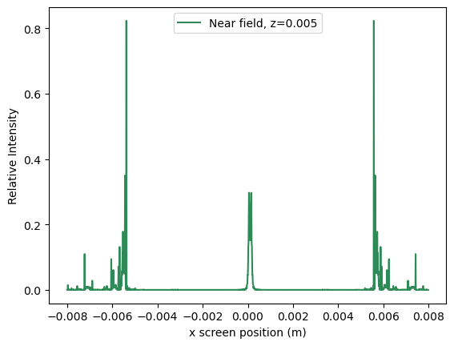
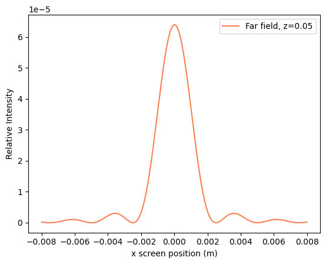
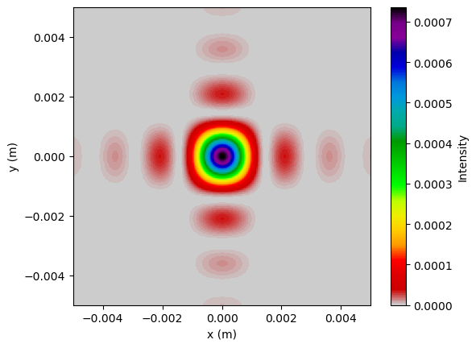
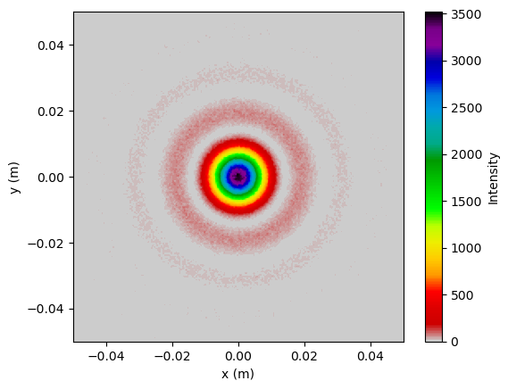

## Fresnel Diffraction 

In this project, 1D and 2D Fresnel/Fraunhofer diffraction patterns were computed using scipy.integrate.dblquad, to solve double integrals.
The equation considered was the following

The problem was approached from different angles:
- 1d diffraction pattern (near field, far field)
- 2d diffraction pattern from a 2d square aperture
- 2d diffraction pattern from a circular aperture
- 2d diffraction pattern from a circular aperture using a Monte Carlo method.

For the 1d diffraction pattern, the y argument was kept at 0, while many values of x were input into the equation.
For the 2d diffraction pattern, an empty square grid of values had to be generated in order to input the calculated intensity values

In all these problems, the real and imaginary components of the diffraction equation had to be separated, as dblquad lacks the ability to compute integrals with imaginary components.
The intensity was then calculated by summing the squares of the real and imaginary parts and square rooting the result. 

For the Monte Carlo section, we solve for the integral using the following equations:

The Monte Carlo method works in the following way:
- We set out integration limits to be -R to R for both the inner and outer integrals. This would correspond to a square with dimensions RxR, which encapsulates our circle.
- For each point on our grid, we generate N_samples random numbers. This is achieved by looping over the x values and then looping over the y values.
- For each of this random values, we filter the ones that lie within the circle and retrieve the real and imaginary components. If outside the circle, both components are assigned a value of 0.
- For that specific point, the real parts and imaginary parts are averaged separately.
- The mean values for the real and imaginary parts are then used to compute the intensity for that point, by summing the squares and then multiplying by the aperture area.
- The intensity is then added to an square array corresponding to our intensity values, with each corresponding to certain (x,y) coordinates.

## Results:

## Skills used
- scipy.integrate
- matplotlib
- numpy

